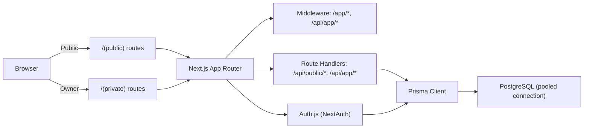

# Dev OS Architecture (M0 Foundation)

## 1) One-line summary
Single Next.js(App Router) app that serves **Public Portfolio** with ISR and protects **Private Owner Dashboard** with Auth.js + middleware, backed by PostgreSQL + Prisma.

---

## 2) System overview


---

## 3) Public / Private boundary
- **Routing layer**: `(public)` and `(private)` Route Groups.
- **Middleware**: Block `/app/*` + `/api/app/*` when unauthenticated or not owner.
- **API layer**: `/api/public/*` vs `/api/app/*` naming split.
- **Owner-only policy**: `User.isOwner === true` must be enforced for private access.

---

## 4) Tech stack (fixed for v1)
- Next.js (App Router)
- Auth.js (NextAuth) + Prisma Adapter
- Prisma ORM + PostgreSQL
- Tailwind CSS (UI)
- Vercel (deploy)

---

## 5) Folder structure
```
/src
  /app
    /(public)
    /(private)
    /api
  /lib
  /components
/prisma
```

---

## 6) Route groups
- **Public**: `/`, `/projects`, `/projects/[slug]`, `/auth/*`
- **Private**: `/app`, `/app/*`
- **API**
  - Public: `/api/public/*`
  - Private: `/api/app/*`

---

## 7) Environment variables
Required (M0):
- `DATABASE_URL` (pooled connection string)
- `AUTH_SECRET`
- `AUTH_TRUST_HOST`
- `AUTH_GITHUB_ID`
- `AUTH_GITHUB_SECRET`
- `OWNER_EMAIL` (optional override for owner allowlist)
- `NEXT_PUBLIC_SITE_URL`

---

## 8) Security / performance decisions
- **Session strategy**: JWT (Edge middleware compatibility).
- **Cookies**: HttpOnly + Secure (prod) + SameSite=Lax.
- **Public pages**: ISR with `revalidate` (time-based).
- **Private pages**: no cache; owner-only access.

---

## 9) DB connection / pooling (serverless)
- Use a **pooled** PostgreSQL connection string (Prisma Postgres or Neon pooled).
- Keep Prisma client singleton in `src/lib/prisma.ts`.
- Avoid per-request client instantiation to prevent connection storms.

---

## 10) Decision log (M0)
- Split API namespaces: `/api/public/*` vs `/api/app/*`.
- Protect private routes via middleware + server-side owner check.
- JWT sessions for edge-safe auth validation.

