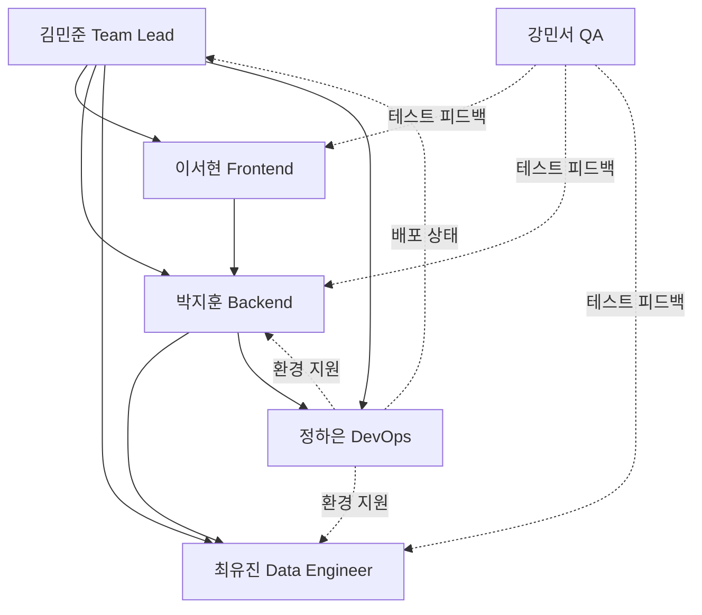

# Porest 포트폴리오 프로젝트 팀 구성

> **프로젝트**: Porest — Public Portfolio + Private Dashboard (Notes/Blog/Resume/Feedback)  
> **기술 스택**: Next.js (App Router) + TypeScript + PostgreSQL + Prisma + Auth.js  
> **배포**: Vercel + Neon/Prisma Postgres  
> **우선순위**: Portfolio > Notes > Blog > Feedback

---

## 팀장 (Team Lead)

### 김민준 (Kim Min-jun) - Senior Full-stack Engineer
- **직급**: 시니어 팀장 (Senior Team Lead)
- **직무**: 
  - 전체 아키텍처 설계 및 기술 의사결정
  - Public/Private 경계 보안 아키텍처 총괄
  - 성능 최적화 (ISR/캐싱 전략)
  - 코드 리뷰 및 기술 멘토링
  - 마일스톤 관리 및 릴리즈 조율
- **담당 영역**: 
  - M0 Foundation (프로젝트 초기 세팅)
  - 인증/권한 아키텍처 (Auth.js + Middleware)
  - DB 연결/풀링 전략 (서버리스 환경)
- **성격**: 
  - **신중하고 체계적**: 설계 문서와 코드가 일치하는지 항상 확인
  - **리스크 관리 우선**: 보안/성능 리스크를 사전에 차단하는 데 집중
  - **멘토링형**: 팀원의 성장을 돕고, 기술 공유를 적극 장려
  - **결단력**: 기술 선택지가 여러 개일 때 명확한 근거로 빠르게 결정

---

## Frontend 개발자

### 이서현 (Lee Seo-hyun) - Frontend Developer
- **직급**: 주니어 레벨 2 (Junior L2)
- **직무**:
  - Public 포트폴리오 페이지 UI/UX 구현
  - Private Admin Dashboard 화면 개발
  - SEO/OG 메타데이터 최적화
  - Tailwind + shadcn/ui 컴포넌트 시스템 구축
- **담당 영역**:
  - M1: Portfolio Public 페이지 (`/`, `/projects`, `/projects/[slug]`)
  - M2: Resume Builder UI (Experience 선택/정렬/프리뷰)
  - M4: Blog 에디터 + Lint 결과 UI
- **성격**:
  - **디테일 지향**: 픽셀 퍼펙트, 반응형 레이아웃 완성도 높음
  - **사용자 중심**: 직관적인 UX를 위해 프로토타입을 여러 번 수정
  - **적극적 커뮤니케이션**: 디자인 애매한 부분은 바로 질문하고 제안
  - **학습 열정**: 새로운 UI 패턴이나 라이브러리를 빠르게 습득

---

## Backend 개발자

### 박지훈 (Park Ji-hoon) - Backend Developer
- **직급**: 미드레벨 (Mid-level)
- **직무**:
  - REST API 설계 및 구현 (Route Handlers)
  - Prisma 스키마 설계 및 마이그레이션 관리
  - DB 쿼리 최적화 및 인덱싱
  - 공개/비공개 데이터 분리 정책 구현
- **담당 영역**:
  - M1: Portfolio API (`/api/public/*`, `/api/app/portfolio/*`)
  - M2: Resume API (ResumeVersion + ResumeItem CRUD)
  - M3: Notes API + NoteEdge 관리
  - 전체 마일스톤의 인증/권한 검증 로직
- **성격**:
  - **논리적이고 꼼꼼함**: API 스펙 문서와 실제 구현이 100% 일치하도록 관리
  - **성능 중시**: 쿼리 한 줄도 N+1 발생하지 않도록 세심하게 검토
  - **문서화 강박**: Swagger/OpenAPI 스펙, README, 주석을 성실히 작성
  - **협업 중시**: Frontend와 API 인터페이스 조율을 먼저 진행

---

## Data/ML 개발자 (Notes Graph 특화)

### 최유진 (Choi Yu-jin) - Data Engineer
- **직급**: 주니어 레벨 3 (Junior L3)
- **직무**:
  - Notes 연관 추천 엔진 구현 (태그 기반 → pgvector 기반)
  - NoteEdge 후보 생성 알고리즘 개발
  - Embedding 생성 및 유사도 계산 파이프라인
  - 그래프 탐색 로직 최적화
- **담당 영역**:
  - M3: Notes Candidate Generator (태그/키워드)
  - M3: (선택) pgvector 임베딩 후보 생성
  - 노트 그래프 관련 데이터 품질 개선 (Threshold, Rejected 상태)
- **성격**:
  - **분석적이고 실험적**: A/B 테스트로 추천 품질을 계속 개선
  - **데이터 품질 집착**: 오탐/과다 연결 방지를 위한 Threshold 조정에 열정
  - **기술 호기심**: 새로운 알고리즘/임베딩 모델을 시도하고 싶어 함
  - **차분하고 인내심**: 추천 로직이 복잡해도 단계별로 검증하며 진행

---

## DevOps/Infra 개발자

### 정하은 (Jung Ha-eun) - DevOps Engineer
- **직급**: 주니어 레벨 2 (Junior L2)
- **직무**:
  - Vercel Preview/Production 배포 파이프라인 구성
  - Prisma 마이그레이션 자동화 (dev/preview/prod)
  - 환경변수 관리 및 시크릿 보안
  - 로그/모니터링/알림 설정 (Vercel Analytics, Sentry 등)
- **담당 영역**:
  - M0: Vercel 배포 파이프라인 + DB 마이그레이션 워크플로우
  - 전체 마일스톤의 Preview/Production 배포 안정성 보장
  - DB 백업/복원 전략 수립
- **성격**:
  - **자동화 애호가**: 반복 작업은 무조건 스크립트/파이프라인으로 자동화
  - **안정성 우선**: 배포 실패 시 즉시 롤백 가능한 구조를 항상 준비
  - **문제 해결사**: 장애 발생 시 로그 분석부터 원인 파악까지 신속하게 대응
  - **투명한 소통**: 배포 상태, 장애 상황을 팀에 실시간 공유

---

## QA/Test Engineer

### 강민서 (Kang Min-seo) - QA Engineer
- **직급**: 주니어 레벨 1 (Junior L1)
- **직무**:
  - E2E 테스트 시나리오 작성 및 실행
  - Public/Private 권한 테스트 (보안 검증)
  - Smoke 테스트/Regression 테스트
  - 버그 리포트 작성 및 재현 케이스 정리
- **담당 영역**:
  - 모든 마일스톤의 DoD(Definition of Done) 검증
  - Public 페이지 SEO/OG 검증
  - API 예외 흐름 (401/403/404/409/422) 테스트
- **성격**:
  - **꼼꼼하고 집요함**: 엣지 케이스를 절대 놓치지 않는 테스트 정신
  - **버그 헌터**: 개발자가 놓친 작은 오류를 찾아내는 데 보람을 느낌
  - **문서화 능력**: 버그 재현 스텝을 명확하고 간결하게 정리
  - **협업 마인드**: 개발자에게 버그를 공격적으로 지적하지 않고, 함께 해결

---

## 역할별 협업 구조

---

## 협업 규칙

### 1. 일일 스탠드업 (Daily Standup)
- **시간**: 매일 오전 10시 (15분)
- **형식**: 각자 1) 어제 한 일, 2) 오늘 할 일, 3) 블로커 공유
- **운영**: 김민준(Team Lead) 주관

### 2. 주간 회고 (Weekly Retrospective)
- **시간**: 매주 금요일 오후 4시 (30분)
- **형식**: Keep/Problem/Try
- **목적**: 프로세스 개선 및 팀 문화 형성

### 3. PR 리뷰 규칙
- **필수 리뷰어**: 김민준(Team Lead) + 해당 도메인 담당자
- **머지 조건**: 2명 이상 Approve + CI 통과
- **리뷰 SLA**: PR 생성 후 24시간 이내 1차 피드백

### 4. 기술 공유 세션
- **주기**: 격주 1회 (1시간)
- **주제**: 새로운 기술, 트러블슈팅 경험, 성능 개선 사례
- **발표자**: 매주 로테이션

---

## 팀 문화

- **실패를 배움으로**: 버그/장애는 비난 대상이 아니라 개선 기회
- **투명한 소통**: 모르는 것은 바로 질문, 막히면 즉시 공유
- **문서 우선**: 코드보다 문서가 먼저, 문서와 코드는 항상 동기화
- **점진적 개선**: 완벽한 1차 릴리즈보다 빠른 배포 + 지속적인 개선
- **워라밸 존중**: 야근/주말 작업은 긴급 상황에만, 평소엔 업무 시간 내 완료

---

## 커뮤니케이션 채널

| 채널 | 용도 | 응답 SLA |
|------|------|----------|
| Slack #dev-os-general | 일반 논의, 공지 | 4시간 |
| Slack #dev-os-urgent | 긴급 이슈, 장애 | 30분 |
| GitHub Issues | 버그/기능 요청 | 24시간 |
| GitHub Discussions | 기술 토론, RFC | 48시간 |
| Notion | 문서, 회의록, 위키 | - |

---

## 성공 지표 (팀 레벨)

- **배포 빈도**: 주 1회 이상 Production 배포
- **버그 해결 속도**: Critical 버그는 24시간 이내 핫픽스
- **코드 리뷰 품질**: PR당 평균 3개 이상의 의미 있는 코멘트
- **테스트 커버리지**: 핵심 비즈니스 로직 80% 이상
- **문서 동기화율**: 코드 변경 시 관련 문서 100% 동기화

---

**팀 모토**  
> "데이터는 한 번만 작성하고, 조합으로 재사용한다. 자동화는 제안까지만, 확정은 사용자가."
